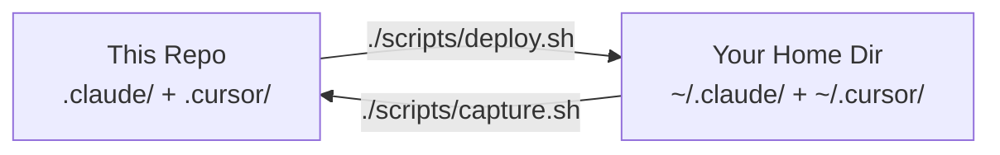

# claude-toolkit

[](https://opensource.org/licenses/MIT)
[](https://github.com/ArangoGutierrez/claude-toolkit/actions/workflows/lint.yml)
[](https://github.com/ArangoGutierrez/claude-toolkit/actions/workflows/validate-cursor.yml)

A shareable toolkit of **Claude Code** and **Cursor IDE** configuration — skills,
hooks, rules, and agent workflows — that turns AI-assisted development into a
disciplined engineering practice. You get TDD enforcement, GPG-signed commits,
worktree isolation, agent-driven workflows, and a Graphify code-graph integration,
all enforced by hooks at the toolchain level rather than written down in a
convention doc that gets ignored. Clone, deploy, and every AI session follows the
same engineering standards automatically.

## What This Gives You

| Without This Config | With This Config |
|---------------------|-----------------|
| AI writes code directly on main | Implementation isolated in worktrees |
| No test discipline | TDD enforced — implementation blocked without failing tests |
| Unsigned commits | All commits GPG-signed with DCO signoff |
| Manual code review | Multi-agent quality gates (audit, perf, security) |
| Blind `grep` to understand code | Query a Graphify code graph first, then read specifics |
| No guardrails on dangerous commands | Guardrails on destructive commands (confirm force-push main; block `rm -rf /`) |

## Architecture Overview

This repo is a mirror of your Claude Code and Cursor IDE configuration.
`scripts/deploy.sh` syncs from the repo to `~/`. `scripts/capture.sh` refreshes the
repo from your live config (allowlist — only files already tracked here, so nothing
private leaks in). `scripts/diff.sh` shows drift between the two.



The repo layout mirrors the home directory exactly so rsync can deploy without
path translation. See the [Architecture deep-dive](docs/architecture.md) for the
agents-workbench pattern, worktree isolation model, and hook execution order.

## Quick Start

```bash
git clone https://github.com/ArangoGutierrez/claude-toolkit.git
cd claude-toolkit
./scripts/deploy.sh --dry-run  # preview changes before applying
./scripts/deploy.sh            # deploy with automatic backup
```

The deploy script rsyncs `.claude/` and `.cursor/` to your home directory.
A timestamped backup is created automatically before any files are overwritten.

See [Getting Started](docs/getting-started.md) for prerequisites, verification
steps, and a first-session walkthrough.

## What's Included

### Claude Code (`.claude/`)

| Component | Count | Purpose |
|-----------|-------|---------|
| **CLAUDE.md** | 1 | Engineering standards (TDD, worktrees, iteration budgets) |
| **settings.json** | 1 | Permissions, hook wiring, plugin config, environment |
| **Hooks** | 19 | inject-date, sign-commits, prevent-push-workbench, enforce-worktree, validate-year, tdd-guard, auto-format, bash-audit-log, build-helpers, context-watch, mutation-gate, permission-denied, pre-compact-context, reflection-staleness, session-goal-init, test-dep-map, test-quality-lint, graphify-graph-hint, verify-gate |
| **Skills** | 14 | eureka, go-review, goal, handoff, k8s-debug, kickoff, pr-review-ingest, reflection, skill-eval, tdd-protocol, team-{plan,execute,shutdown}, worktree-guide — each ships a human-facing README; see the [Skills & Commands reference](docs/skills-and-commands.md) |
| **Rules** | 8 | constitution, go/k8s/container conventions, git-workflow, security, graphify, learned-anti-patterns |
| **Agents** | 4 | doc-writer, explorer, principal-engineer, qa-engineer |
| **Commands** | 3 | team-plan, team-execute, team-shutdown (multi-agent coordination) |
| **Team Library** | 11 | Architect reference material, planning guide, QA validator, decision templates |
| **Policies** | 2 | remote-settings.json, policy-limits.json |
| **Scripts** | 1 | setup-workbench.sh (initializes the agents-workbench branch) |
| **Templates** | 1 | AGENTS.md template for task coordination |
| **.claudeignore** | 1 | Context exclusions for large/irrelevant files |

### Cursor IDE (`.cursor/`)

| Component | Count | Purpose |
|-----------|-------|---------|
| **Agents** | 12 | researcher, auditor, arch-explorer, task-analyzer, perf-critic, api-reviewer, devil-advocate, prototyper, synthesizer, verifier, review-triager, ci-doctor |
| **Commands** | 17 | /architect, /audit, /code, /research, /review-pr, /test, and more |
| **Skills** | 13 | Cursor-native config skills (create-rule, create-skill, canvas, and more) |
| **Rules** | 8 | core, tdd, workbench, go, k8s, node, python, rust (.mdc format) |
| **Hooks** | 4 | format, sign-commits, security-gate, task-loop |
| **Schemas** | 3 | JSON schemas for hooks and state validation |

### Graphify code-graph integration

[Graphify](https://pypi.org/project/graphify/) builds a queryable **code knowledge
graph** so the agent navigates by structure instead of blind `grep` — a large token
saving on big or unfamiliar codebases. This toolkit wires it in:

- **`scripts/graphify-bootstrap.sh [PATH]`** — builds the graph for a repo via
  `graphify update` (AST extraction; **no LLM, no API key**).
- **`.claude/hooks/graphify-graph-hint.sh`** — a `PreToolUse(Bash | Glob | Grep)`
  hook that, *once per session*, reminds the agent to query the graph before raw
  source search. A silent no-op in repos without a graph.
- **`.claude/rules/graphify.md`** — the always-loaded directive on querying the graph.

```bash
pipx install graphify             # one-time
./scripts/graphify-bootstrap.sh   # build graphify-out/graph.json for the current repo
```

### Key Behaviors Enforced

- **TDD Guard**: Blocks implementation files without corresponding test files
- **Signed Commits**: All commits require `-s -S` (DCO + GPG)
- **Worktree Isolation**: Source is read-only on `agents-workbench`; implementation happens in `.worktrees/`
- **Year Validation**: New files must use the current year in copyright headers
- **Security Gate**: Blocks dangerous commands (`rm -rf /`, force-push to main)
- **Auto-format & test-quality-lint**: PostToolUse hooks format code and check test quality on every Write/Edit
- **Graph-first navigation**: When a Graphify graph exists, the agent is nudged to query it before raw search

## Documentation

| Document | Description |
|----------|-------------|
| [Getting Started](docs/getting-started.md) | Prerequisites, installation, verification |
| [Architecture](docs/architecture.md) | agents-workbench deep-dive with diagrams |
| [Claude Code](docs/claude-code.md) | Hooks, settings, plugins, policies |
| [Cursor](docs/cursor.md) | Agents, commands, rules, hooks |
| [Deployment](docs/deployment.md) | deploy.sh, capture.sh, diff.sh scripts |
| [Skills & Commands](docs/skills-and-commands.md) | Complete reference |

## Requirements

- **macOS or Linux** (Windows/WSL untested)
- **Claude Code** (required — <https://docs.anthropic.com/claude-code>)
- **Cursor** (required for Cursor config — <https://cursor.com>)
- **jq** (for hooks that parse JSON)
- **GPG** (for signed commits)
- **rsync** (for deploy/capture scripts)
- **graphify** (optional, for the code-graph integration: `pipx install graphify`)

## Contributing

1. Fork this repo
2. Edit configs in `.claude/` and `.cursor/` directly, or edit live and run `./scripts/capture.sh`
3. Deploy with `./scripts/deploy.sh`
4. Open a PR against `main`

## License

[MIT](LICENSE)
